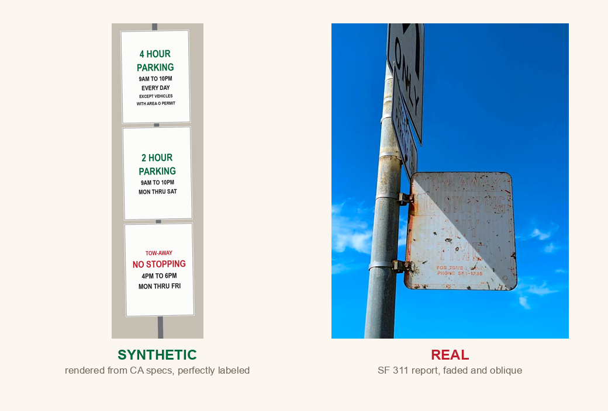
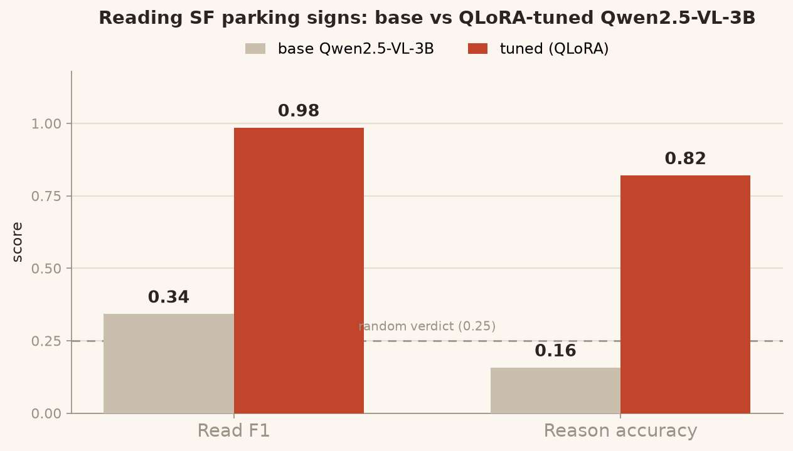

<h1 align="center">curbcheck 🅿️</h1>

<p align="center"><b>Can a small VLM tell you if you can legally park in San Francisco?</b></p>

<p align="center">
  
  
  
  
</p>

<p align="center"></p>

---

## A $160 origin story

I spent a week in San Francisco in April 2026. I came home with good memories and **two
parking tickets**, both for the same reason: I stood in front of a pole holding four signs,
read all four, and *still* could not work out whether I was allowed to leave my car there.

You know the pole. A 2-hour limit. *Except* with an Area S permit. *Except* it's also a
street-cleaning zone Tuesday mornings. *Also* tow-away during evening rush. Each sign is
legible alone. Stacked, they form a little logic puzzle with a time variable, and my
jet-lagged, double-parked brain did not solve it. Twice.

The maddening part: every fact you need is printed right there. It is pure perception plus
rule-logic plus a clock. So, the question:

> **Can a small, cheap, runs-on-a-phone vision-language model do the thing my brain failed to do?**

Turns out the off-the-shelf one can't. But you can teach it, for about four dollars.

---

## The result

<p align="center"></p>

A stock Qwen2.5-VL-3B scores **0.15** on "can I park here right now", *below* the 0.25 you'd
get by guessing among four verdicts. One QLoRA run on synthetic + teacher-labeled data, ~$4 of
GPU, takes it to **0.76 reasoning** and **0.96 read accuracy**.

| Model | Read F1 | Reason accuracy |
|---|:---:|:---:|
| Qwen2.5-VL-3B (base) | 0.35 | 0.15 🪦 |
| **Qwen2.5-VL-3B (tuned)** | **0.96** | **0.76** 🚀 |

And difficulty scales exactly the way the origin story predicts, with the number of signs on
the pole:

```
tuned model, reasoning accuracy by stack size
  1 sign   ████████████████████  0.87
  2 signs  ██████████████████    0.77
  3 signs  ██████████████        0.60
  4 signs  █████████             0.39   ← the pole that cost me two tickets
```

---

## How it works: read, then reason (and show your work)

The lazy version prints "✅ you can park" and you trust it. curbcheck splits the job so you
can *see* the reasoning, and learn the sign yourself:

```
  photo ─▶  VLM (perception)  ─▶  structured rules  ─▶  resolver (logic)  ─▶  verdict
                                       │                                        │
                                  "here's what                            "street cleaning
                                  each sign says"                          doesn't apply: it's Wed"
```

- The **VLM only reads** the pole into structured restrictions.
- A tiny **deterministic resolver** (`schema/rules.py`, no model in the loop) applies them to
  the current time and returns the verdict + the reason.
- **Both halves are shown to you.** Misreads are visible, not buried in a confident sentence.
  And a user who sees "✗ street cleaning, today is Wednesday" a few times learns to read the
  pole themselves. The goal is for you to eventually not need this.

That split is also why the project is rigorous: the demo's "what each sign says" view and the
benchmark's Read metric are literally the same thing.

---

## What's in the box

curbcheck is four artifacts:

1. **The exam**: a benchmark of parking-sign images with exact ground truth and three
   question layers: **read** (extract rules to JSON), **reason** (can I park at 5:30pm?),
   **abstain** (signs alone can't tell, say so).
2. **The report card**: a leaderboard of small VLMs vs a frontier reference, scored by sign
   count.
3. **The student**: a QLoRA-tuned 3B model (the result above).
4. **The demo**: photo in, week-grid out *(coming soon)*.

### Where the data comes from

| Source | What | Truth |
|---|---|---|
| 🏗️ Renderer | 2,000 synthetic stacks from CA sign specs | exact, by construction |
| 📷 SF 311 + DPW | 2,462 real SF photos | labeled by Opus (teacher distillation) |
| 🗂️ SFMTA inventory | 144,333 real signs | seeds realistic rule distributions |

77% synthetic, 23% real. Two license tiers, no Google Street View, citizen photos referenced
by URL not rehosted. Full map in [`notes/sources.md`](notes/sources.md).

---

## Repo tour

```
schema/rules.py        the restriction model + can_park() resolver (the ground-truth engine)
render/signs.py        synthetic CA-style sign-stack renderer
bench/                 build the eval benchmark + the synthetic training set
harvest/               real-photo collection + Opus teacher labeling
eval/                  frontier-reference scorer
modal_app/             train.py (QLoRA), eval_sweep.py (leaderboard), upload.py
docs/HOW_IT_WORKS.md   the full architecture deep-dive
docs/RESULTS.md        measured numbers
```

## Quickstart

```bash
uv venv && uv pip install pillow
.venv/bin/python bench/generate.py --n 12          # build a tiny eval set
.venv/bin/python -m modal run modal_app/train.py   # QLoRA on a rented A100 (~$4)
.venv/bin/python -m modal run modal_app/eval_sweep.py
```

Deep dive in **[docs/HOW_IT_WORKS.md](docs/HOW_IT_WORKS.md)**. Built by
[Shubham Goel](https://shubham.gg). MIT licensed.

> Still mad about those tickets. But at least now there's a model that gets it.
